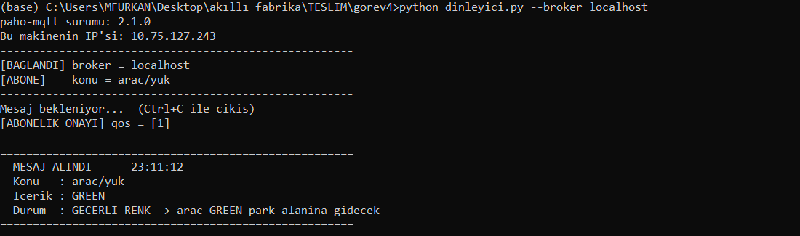
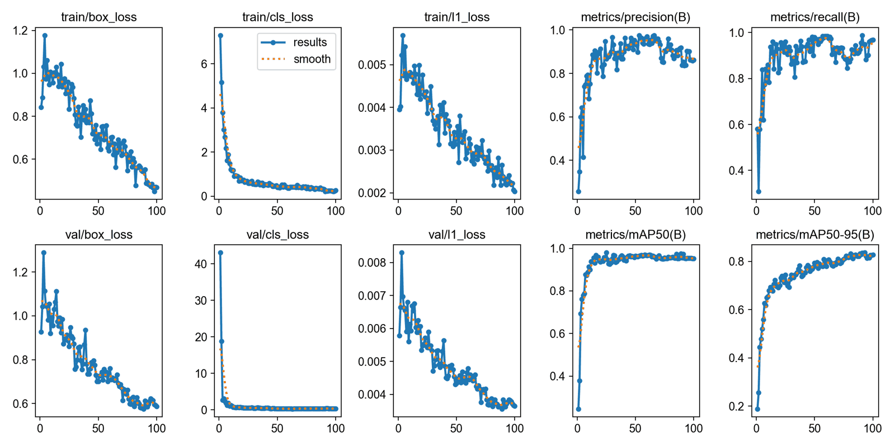

# TEKNOFEST 2026 Akıllı Fabrika Sistemleri Programlama

TEKNOFEST 2026 Akıllı Fabrika Sistemleri Programlama yarışmasının yarı final
aşaması için hazırladığımız çözümler. Senaryoda robot kol ürünün rengini algılayıp
otonom araca bildiriyor, araç da yükü ilgili park alanına götürüyor. Yarışma
altı görevden oluşuyordu. İlk beş görevin kodu bu depoda ayrı klasörlerde duruyor.

Takım: andromeda (Mehmet Furkan Ketme, Furkan Karslı). Yarı finalde 2., finalde 7. olduk.

## Görevler

| Klasör | Konu | Kullanılanlar |
| --- | --- | --- |
| `gorev1-algoritma` | Robot kol ve otonom aracın birlikte çalıştığı sistemin akış şeması ve sözde kodu | LaTeX |
| `gorev2-step-motor` | Step motoru bilgisayardan süren arayüz | Python, tkinter, pyserial, Arduino, AccelStepper |
| `gorev3-renk-algilama` | Kameradan kırmızı, yeşil ve mavi küp algılama | OpenCV |
| `gorev4-mqtt` | Robot kol ile araç arasında renk bilgisinin iletilmesi | MQTT, mosquitto, paho-mqtt |
| `gorev5-tabela-tespiti` | Trafik tabelası tespiti için model eğitimi ve canlı tespit | YOLO26, Ultralytics |
| Görev 6 | Üretim hattının PLC programı ve operatör paneli (depoda yok) | TIA Portal V17 |

## Görev 2: Step motor kontrolü

Arduino ile bilgisayar arasında basit bir seri protokol tanımladık. Bilgisayar
`PING`, `START <hız> <yön>`, `STOP`, `GOTO <hedef>` ve `SIFIRLA` komutlarını
gönderiyor. Arduino her komuta `HAZIR`, `OK` ya da `ERR` ile cevap veriyor ve
belirli aralıklarla konumu, durumu ve hızı bildiriyor.

Konum sayacı Arduino tarafında tutuluyor, arayüz yalnızca gelen değeri gösteriyor.
Böylece seri hatta kaybolan bir mesaj konumun kaymasına yol açmıyor. Kaydedilen
konumlar `konumlar.json` dosyasında saklanıyor, program kapatılıp açıldığında
kayıtlar yerinde duruyor.

Donanım: DM556 sürücü, PUL için D2, DIR için D3, 1/8 mikro adım (1600 adım/tur),
115200 baud. Motor bağlı değilken arayüz `--sahte` parametresiyle benzetim modunda
çalışıyor. Gerçek motor elimizde olmadığı için bu görevi benzetim modunda test ettik.

## Görev 3: Renk algılama

Görüntü HSV'ye çevrilip her renk için ayrı maske çıkarılıyor. Kırmızı, Hue
ekseninin iki ucunda yer aldığı için tek bir aralıkla yakalanamıyor. Bu yüzden
iki ayrı aralık tanımlayıp maskeleri `bitwise_or` ile birleştirdik.

`kamera_ac.py` Windows'ta farklı kamera arka uçlarını ve indekslerini sırayla
deneyip çalışan ilk kombinasyonu açıyor. Dahili ve USB kameraların farklı
davrandığı durumlarda işe yarıyor.

## Görev 4: MQTT haberleşme

Robot kol `arac/yuk` konusuna `RED`, `GREEN` ya da `BLUE` yayımlıyor, araç bu
konuya abone olup gelen rengi bekliyor. paho-mqtt 2.x sürümünde callback
imzaları değiştiği için istemci `CallbackAPIVersion.VERSION2` ile kuruluyor.



## Görev 5: Tabela tespiti

Organizasyon dört sınıfa (yaya geçidi, tümsek, hemzemin geçit, park) ait 129
etiketsiz görsel verdi. Etiketlemeyi hızlandırmak için `etiketleme/` klasöründe
birkaç araç yazdık:

- `on_etiketle.py`: HSV maskeleriyle taslak kutular üretiyor, elle yalnızca
  düzeltme yapmak kalıyor.
- `web_etiketle.py`: tarayıcıdan çalışan küçük bir etiketleme aracı.
- `etiket_denetcisi.py`: biçim hatalarını, etiketsiz kalmış renkli bölgeleri ve
  birbiriyle çakışan kutuları raporluyor.
- `veri_hazirla.py`: her sınıfın hem eğitim hem doğrulama kümesinde bulunması için
  tabakalı ayrım yapıp `data.yaml` üretiyor.

Model YOLO26-L tabanından 100 epoch eğitildi (imgsz 640, batch otomatik).
Doğrulama kümesinde mAP50 0,952.



Tabela görselleri yarışmaya ait olduğu için veri seti ve eğitilmiş ağırlık dosyası
depoda yok.

## Görev 6: PLC ve HMI

Üretim hattının PLC programı ve operatör paneli TIA Portal V17'de hazırlandı.
Proje dosyaları bu depoda yer almıyor.

## Çalıştırma

Python 3.10 ile yazıldı.

```bash
pip install -r requirements.txt

# Görev 2 (motor yoksa --sahte)
python gorev2-step-motor/arayuz.py --port COM5

# Görev 3
python gorev3-renk-algilama/renk_algila.py --kamera 0

# Görev 4 (önce dinleyici, sonra yayıncı)
python gorev4-mqtt/dinleyici.py --broker <broker IP adresi>
python gorev4-mqtt/yayinci.py --broker localhost --renk GREEN

# Görev 5
python gorev5-tabela-tespiti/egitim.py --data gorev5-tabela-tespiti/data.yaml
python gorev5-tabela-tespiti/tespit.py --model best.pt --kamera 0
```

Görev 4 için broker bilgisayarında `mosquitto.conf` dosyasına `listener 1883` ve
`allow_anonymous true` satırlarının eklenmesi gerekiyor. Görev 2'deki Arduino kodu
için AccelStepper kütüphanesi kurulu olmalı.
